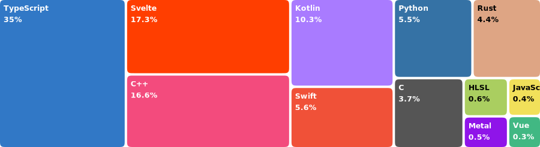

# Language Treemap for GitHub Readme

A simple treemap for visualizing the languages used in your Github repository. 

## Deploy with Cloudflare Workers

1. Generate a GitHub Personal Access Token.

2. Fill the variables in `wrangler.toml` with your Github username and the generated token.

2. Run `npm run deploy`.
